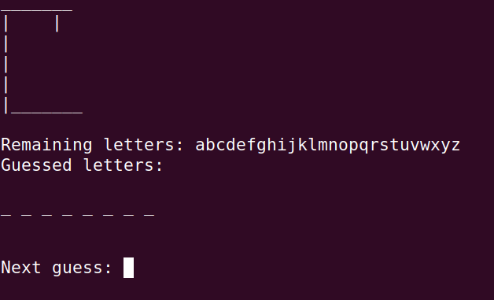
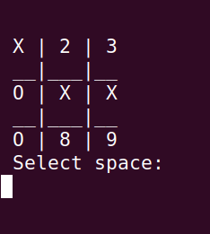
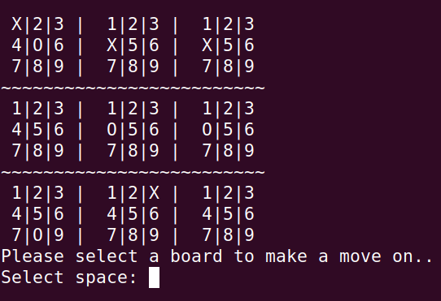

# Terminal Games.
These are terminal games made by me, mostly for me. This should grow slowly over time, as I regain interest in the project. All games are written in vanilla Python3, so no additional packages will be needed.

Each game should have its own README file explaining its usage.
> Games have only been tested on Linux.

## Short List
- Hangman
- TicTacToe
  - Embedded TicTacToe

### Hangman
Hangman game with a large custom dictionary to pull from. Outside dictionaries are supported. Read docs, to understand use.

### TicTacToe/Embedded TicTacToe
Basic TicTacToe game meant to be played by 2 players. No bot to face.

Includes an embedded TicTacToe, where traditional spaces are now entire ttt games of their own. Adds a new complexity to playing 😉

