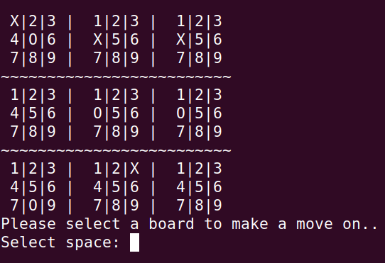

# TicTacToe

A simple TicTacToe game to play with another person.

## Embedded  TicTacToe
This embedded TTT game is a continuation of TTT. You must first select a board to play, of which is selected with the same 1-9 selection process. You are then instructed to make your move on the selected board.

To win this game, you must win 3 consecutive boards. This game will be much longer as the minimum number of moves needed to win is 17.

